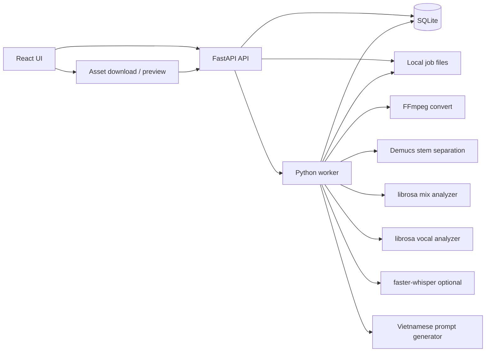

# Audio Intelligence Prompt Builder MVP Design

## 1. Purpose

Build a local-first MVP that accepts an `.mp3` reference track, analyzes the song tone and singer voice characteristics, and generates a Vietnamese prompt suitable for ACE-Step-1.5 music generation.

The MVP focuses on producing a useful Vietnamese `tags/prompt` string. It does not generate lyrics, does not call ACE-Step directly, and does not attempt identity recognition.

Example output:

```text
nhac pop ballad Viet Nam, tempo cham 82 BPM, tong La thu, giong nam cao sang, am sac trong va hoi da diet, piano chu dao, trong nhe, bass mem, khong khi cam xuc phu hop cho diep khuc tru tinh
```

## 2. Product Scope

### In Scope

- Upload one `.mp3` file from a local web UI.
- Validate file type, file size, duration, and decode readiness.
- Convert the input to normalized WAV with FFmpeg.
- Separate stems with Demucs:
  - `vocals.wav`
  - `drums.wav`
  - `bass.wav`
  - `other.wav`
- Analyze full mix for:
  - BPM / tempo bucket
  - rough key and scale
  - loudness and energy
  - spectral brightness
  - simple instrumentation hints from stems
- Analyze vocal stem for:
  - median pitch
  - vocal range bucket
  - brightness bucket
  - power / breathiness heuristic
  - voice descriptor for prompt usage
- Optionally detect Vietnamese language from vocal stem with `faster-whisper`.
- Generate a Vietnamese prompt automatically from metadata and confidence scores.
- Show job progress, result prompt, JSON metadata, and generated audio assets.
- Allow copying the final prompt and downloading metadata JSON.

### Out of Scope

- Lyrics generation.
- Direct ACE-Step-1.5 inference.
- Cloud deployment.
- Multi-user accounts.
- Persistent object storage.
- Precise singer identity, biometric inference, or claims about real gender.
- High-confidence chord progression extraction.
- Full genre/mood ML tagging in the first MVP.

## 3. Tech Stack

### Frontend

- Vite
- React
- TypeScript
- Tailwind CSS
- lucide-react

Rationale: the UI is a focused local tool with upload, progress, and result views. Vite keeps setup light and fast.

### Backend

- Python 3.12 as the primary local runtime
- FastAPI
- Uvicorn
- Pydantic
- SQLite
- SQLModel or SQLAlchemy Core

Rationale: the audio and MIR libraries are Python-native, and FastAPI gives a simple API surface for uploads, polling, and asset downloads. Python 3.12 is the first target for this Windows workstation because PyTorch, Demucs, librosa, and audio packages are more predictable there than on Python 3.13.

### Worker And Audio Pipeline

- Python worker process
- FFmpeg CLI
- PyTorch with CUDA-enabled wheels
- Demucs, pinned to a known working version
- librosa
- soundfile
- numpy
- scipy
- faster-whisper as optional language detection
- Essentia as phase 1.5 optional enhancement

Rationale: Demucs, librosa, and FFmpeg are enough to build the first useful local pipeline. Essentia is powerful, but it can add install/model complexity, so the MVP should not block on it.

### Local Windows CUDA Target

The initial development machine has an NVIDIA GeForce RTX 4060 with 8 GB VRAM. `nvidia-smi` reports driver 591.86 and CUDA runtime 13.1. The MVP should use the GPU for PyTorch-backed steps where available, while keeping CPU fallbacks for portability.

Runtime contract:

- Use `C:\Users\ADMIN\AppData\Local\Programs\Python\Python312\python.exe` or a project venv created from it.
- Do not target Python 3.13 for the first ML/audio environment.
- `nvcc` is not required for the MVP because PyTorch CUDA wheels include the needed runtime pieces.
- FFmpeg must be installed and available on `PATH` before real audio processing is enabled.
- PyTorch must be installed from the official selector with a CUDA wheel that supports the local driver.
- The worker must verify `torch.cuda.is_available()` at startup and record the selected device in logs.
- Demucs should run with CUDA when available and fall back to CPU with a clear warning.
- GPU worker concurrency should start at `1` to avoid exhausting 8 GB VRAM.
- `faster-whisper` should remain optional and default to CPU until its CUDA/cuDNN runtime is validated separately.

Recommended environment smoke checks:

```powershell
nvidia-smi
C:\Users\ADMIN\AppData\Local\Programs\Python\Python312\python.exe --version
ffmpeg -version
.\.venv\Scripts\python.exe -c "import torch; print(torch.__version__); print(torch.cuda.is_available()); print(torch.cuda.get_device_name(0) if torch.cuda.is_available() else 'cpu')"
```

### Local Storage

- SQLite database at `data/app.db`
- Job files under `data/jobs/<job_id>/`

Example:

```text
data/jobs/<job_id>/
  input/original.mp3
  audio/input.wav
  stems/vocals.wav
  stems/drums.wav
  stems/bass.wav
  stems/other.wav
  metadata/result.json
  logs/pipeline.log
```

## 4. Architecture



The API creates jobs and stores input files. The worker runs long audio steps outside request handlers. The UI polls job status until completion and then renders the final prompt and metadata.

## 5. User Flow

1. User opens the local web app.
2. User uploads one `.mp3`.
3. API validates the file and creates a job.
4. UI navigates to the job result page.
5. UI polls status every 1-2 seconds.
6. Worker processes the file through the pipeline.
7. UI displays:
   - final Vietnamese prompt
   - status timeline
   - track metadata
   - vocal descriptor metadata
   - asset previews/download links
8. User copies the Vietnamese prompt for ACE-Step-1.5.

## 6. Job States

```text
uploaded
validating
converting
separating_stems
analyzing_mix
analyzing_vocal
detecting_language
generating_prompt
completed
```

Failure states:

```text
failed_validation
failed_convert
failed_demucs
failed_mix_analysis
failed_vocal_analysis
failed_language_detection
failed_prompt_generation
```

`failed_language_detection` should be non-fatal by default. If language detection fails, the prompt generator continues without asserting source language.

## 7. Data Model

### Job

```json
{
  "id": "uuid",
  "status": "completed",
  "original_filename": "song.mp3",
  "created_at": "2026-06-28T10:00:00Z",
  "updated_at": "2026-06-28T10:04:00Z",
  "error_code": null,
  "error_message": null
}
```

### Analysis Result

```json
{
  "track": {
    "bpm": 82,
    "tempo_bucket": "cham",
    "key": "A",
    "scale": "minor",
    "key_vi": "La thu",
    "energy": "thap",
    "brightness": "sang",
    "instrumentation": ["piano chu dao", "trong nhe", "bass mem"],
    "confidence": {
      "bpm": 0.86,
      "key": 0.62,
      "instrumentation": 0.45
    }
  },
  "vocal": {
    "median_pitch_hz": 220.0,
    "range_bucket": "cao",
    "voice_descriptor": "giong nam cao sang",
    "brightness": "sang",
    "power": "nhe",
    "confidence": {
      "pitch": 0.78,
      "range": 0.7,
      "voice_descriptor": 0.55
    }
  },
  "language": {
    "detected": "vi",
    "label_vi": "Viet Nam",
    "confidence": 0.74,
    "used_in_prompt": true
  },
  "prompt": {
    "tags_vi": "nhac pop ballad Viet Nam, tempo cham 82 BPM, tong La thu, giong nam cao sang, am sac trong va hoi da diet, piano chu dao, trong nhe, bass mem, khong khi cam xuc phu hop cho diep khuc tru tinh",
    "omitted_fields": ["chords"],
    "warnings": ["genre la heuristic co confidence trung binh"]
  }
}
```

Note: persisted JSON should use Unicode Vietnamese in production output. ASCII examples in this design keep the repository style consistent.

## 8. API Design

### `POST /api/jobs`

Accepts multipart upload.

Request:

```text
file: .mp3
```

Response:

```json
{
  "job_id": "uuid",
  "status": "uploaded"
}
```

### `GET /api/jobs/{job_id}`

Returns current status and lightweight progress.

```json
{
  "id": "uuid",
  "status": "analyzing_vocal",
  "progress": 72,
  "current_step": "Dang phan tich giong hat"
}
```

### `GET /api/jobs/{job_id}/result`

Returns final metadata after completion.

### `GET /api/jobs/{job_id}/assets/{asset_name}`

Streams generated audio or JSON assets.

Allowed asset names:

- `original`
- `wav`
- `vocals`
- `drums`
- `bass`
- `other`
- `metadata`

## 9. Module Boundaries

### `upload-service`

- Validate MIME and extension.
- Save original file.
- Create job record.
- Enqueue job for local worker.

### `audio-converter`

- Run FFmpeg.
- Normalize to WAV format expected by analysis:

```bash
ffmpeg -i input.mp3 -ar 44100 -ac 2 output.wav
```

### `stem-separator`

- Run Demucs on WAV.
- Locate produced stems and copy them into the job directory.
- Surface useful logs if Demucs fails.

### `mix-analyzer`

- Load full mix WAV with librosa.
- Estimate BPM.
- Estimate rough key and scale from chroma features.
- Compute energy, loudness, and spectral centroid buckets.
- Estimate simple arrangement hints from stem energy ratios.

### `vocal-analyzer`

- Load `vocals.wav`.
- Estimate pitch contour with `librosa.pyin`.
- Compute median pitch and usable pitch range.
- Map pitch and spectral features to prompt-safe vocal descriptors.
- Avoid claims of real biological sex or identity.

### `language-detector`

- Optional step using `faster-whisper` on `vocals.wav`.
- Only use detected language in prompt when confidence is above threshold.
- If confidence is low, omit language-origin claims while still generating Vietnamese prompt text.

### `prompt-generator`

- Accept normalized metadata and confidence scores.
- Generate Vietnamese ACE-Step-oriented tags.
- Omit low-confidence fields.
- Return warnings for weak or inferred descriptors.

Example fragment rules:

| Metadata | Prompt fragment |
| --- | --- |
| language = vi, confidence >= threshold | `nhac Viet Nam` |
| bpm < 90 | `tempo cham {bpm} BPM` |
| key = A minor | `tong La thu` |
| vocal range = high, brightness = bright | `giong cao sang` |
| vocal power = soft | `giong hat nhe va tinh cam` |
| drums stem energy low | `trong nhe` |
| bass stem energy medium | `bass mem` |
| spectral brightness high | `am sac sang` |

## 10. Prompt Policy

The prompt must be Vietnamese and directly useful for ACE-Step-1.5 tags.

The generator should prefer:

- short musical phrases
- comma-separated descriptors
- concrete tempo/key values when confidence is acceptable
- non-biometric voice descriptions
- clear uncertainty handling through omitted fields and metadata warnings

The generator should avoid:

- claiming exact singer identity
- claiming real gender as fact
- forcing genre, language, or instrument labels with weak evidence
- long prose paragraphs
- lyrics or narrative scenes in MVP

## 11. Error Handling

- Validation errors return immediately with clear user-facing messages.
- Pipeline errors persist `error_code`, `error_message`, and current failed state.
- Each step writes logs to `data/jobs/<job_id>/logs/pipeline.log`.
- Optional language detection failure does not fail the whole job.
- Worker should be resumable at the job-step level in a later phase; MVP can start with single-pass processing.

## 12. UI Design

The first screen is the usable app, not a marketing landing page.

Core UI regions:

- upload dropzone
- active job status timeline
- final Vietnamese prompt panel with copy button
- metadata panels for track and vocal descriptors
- generated asset list with preview/download actions

The result page should make the prompt the primary artifact. Metadata should support trust and debugging, not compete with the prompt.

## 13. Testing Strategy

### Unit Tests

- prompt mapping from normalized metadata to Vietnamese tags
- key-to-Vietnamese-name mapping
- confidence-based omission
- job state transitions
- upload validation

### Integration Tests

- API job creation with a small fixture file
- worker pipeline with mocked FFmpeg/Demucs calls
- result JSON serialization
- asset endpoint authorization by allowed asset name

### Environment Smoke Tests

- Confirm Python 3.12 venv is active.
- Confirm FFmpeg is available from the API/worker process.
- Confirm PyTorch imports successfully.
- Confirm CUDA is visible to PyTorch on the RTX 4060.
- Confirm Demucs can run a short fixture with `--device cuda`.
- Confirm the worker logs CPU fallback when CUDA is unavailable.

### Manual Verification

- Run local API and UI.
- Upload a short MP3.
- Confirm job progresses through states.
- Confirm generated prompt is Vietnamese.
- Confirm no low-confidence field is forced into the prompt.
- Confirm assets and metadata are downloadable.

## 14. Implementation Phases

### Phase 0: Local CUDA Bootstrap

- Create a project venv from Python 3.12.
- Install FastAPI/API base dependencies separately from heavy ML dependencies.
- Install FFmpeg and verify it is on `PATH`.
- Install a CUDA-enabled PyTorch wheel and verify `torch.cuda.is_available()`.
- Install Demucs and run a short GPU smoke test.
- Add a checked-in environment verification command or script for repeatable setup.

### Phase 1: App Skeleton

- Monorepo structure with `apps/web` and `apps/api`.
- FastAPI health check and job endpoints.
- Vite React upload/result UI.
- SQLite job persistence.

### Phase 2: Pipeline Without Heavy ML

- FFmpeg conversion.
- librosa mix and vocal analyzers using existing WAV fixtures.
- Rule-based Vietnamese prompt generator.
- Mockable worker interface.

### Phase 3: Stem Separation

- Add Demucs worker step.
- Select `cuda` when available and record GPU name in job logs.
- Store stems.
- Use vocal stem for vocal analysis.
- Use stem energy ratios for arrangement hints.

### Phase 4: Optional Language Detection

- Add `faster-whisper`.
- Use language confidence to decide whether to include Vietnamese origin descriptors.

### Phase 5: Polish And Hardening

- Better UI progress states.
- Clear errors and logs.
- Metadata download.
- Sample fixture and documentation.

## 15. Future Enhancements

- Essentia-based genre/mood/timbre enrichment.
- ACE-Step-1.5 direct generation integration.
- Editable prompt variants after automatic generation.
- Audio fingerprint cache.
- Cloud worker queue with Redis/RQ or Celery.
- GPU-aware worker scheduling.
- More robust chord detection.

## 16. References

- ACE-Step-1.5 project page: https://ace-step.github.io/ace-step-v1.5.github.io/
- ACE-Step GitHub: https://github.com/ace-step/ACE-Step
- FastAPI documentation: https://fastapi.tiangolo.com/
- Vite guide: https://vite.dev/guide/
- PyTorch local installation guide: https://pytorch.org/get-started/locally/
- Demucs GitHub: https://github.com/facebookresearch/demucs
- librosa documentation: https://librosa.org/doc/latest/index.html
- Essentia documentation: https://essentia.upf.edu/
- faster-whisper GitHub: https://github.com/SYSTRAN/faster-whisper
